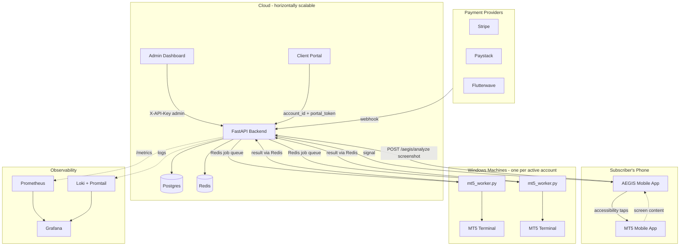

# Architecture

## System diagram

## Why it's split this way

Two fundamentally different scaling problems live in this system, and
conflating them was the biggest architectural mistake in earlier drafts
of this codebase:

1. **Screenshot analysis is stateless and CPU-bound.** Scale it by running
   more API replicas behind a load balancer - nothing about it cares which
   instance handles which request (frame history lives in Redis, not in
   process memory, precisely so this holds).

2. **MT5 trade execution is stateful and single-session-per-process.** The
   `MetaTrader5` Python package can only hold one logged-in connection per
   OS process, and only runs on Windows with the real terminal installed.
   This cannot be scaled the same way as (1) - it needs one worker process
   per active account, which is why `mt5_worker.py` exists as a separate
   deployable unit from the API, coordinated through Redis rather than
   called directly.

## Data flow: screenshot to executed trade

1. Mobile app captures a screenshot on a timer, POSTs it to
   `/aegis/analyze` with `account_id` + `captured_at_ms`.
2. `BrainCVService` extracts indicator pixel positions from the image.
3. `IndicatorHistoryService` stores this frame in a Redis sorted set,
   scored by capture time (not receive time - this is what keeps
   offline-cached/replayed screenshots from corrupting the sequence the
   rule engine depends on).
4. `SignalRuleEngine` evaluates the rolling history against the encoded
   rulebook and returns BUY/SELL/HOLD.
5. Mobile app receives the signal. If BUY/SELL and confidence clears the
   threshold, `Mt5AccessibilityService` taps the corresponding button in
   the MT5 app.

Trade *execution* triggered from the backend side (e.g. via
`/api/trading/market-order`, for server-initiated automation rather than
mobile-triggered) follows a different path: request -> `JobQueueService`
enqueues a job in Redis -> the account's `mt5_worker.py` process picks it
up -> talks to its MT5 terminal -> pushes the result back via Redis.

## Authorization model

See `docs/SECURITY.md` for the full picture. Short version: every request
carries an `X-API-Key`, hashed and looked up against the `api_keys` table,
which resolves to either a specific `account_id` or `is_admin=True`. Every
endpoint that touches a specific account's data explicitly checks the
authenticated key's account matches the requested one (`require_account_match`)
- a key issued to one subscriber cannot be used to act on another
subscriber's account, even though all subscribers' mobile apps talk to the
same backend.
